# RELATÓRIO DE ANÁLISE DE POLÍTICAS DE ESCALONAMENTO COM KERNELSHARK

## Introdução

Este relatório apresenta uma análise detalhada do comportamento de diferentes políticas de escalonamento de threads no Linux, utilizando traces coletados e visualizados com o KernelShark. O objetivo é compreender como cada política afeta a alternância entre threads, a duração dos períodos de execução e o padrão de preempção, fornecendo uma base sólida para discussões sobre desempenho e previsibilidade em sistemas operacionais.

---

## Descrição do Programa

O **sched_profiler** é uma aplicação multithread desenvolvida para analisar e demonstrar o comportamento de diferentes políticas de escalonamento do kernel Linux. O programa cria múltiplas threads que escrevem em um buffer compartilhado, permitindo visualizar como o escalonador do sistema operacional alterna entre as threads sob diferentes políticas.

- Cada thread possui um caractere identificador único (A, B, C, D...)
- Todas as threads escrevem no mesmo buffer global de forma sincronizada
- O padrão resultante no buffer reflete a sequência de execução das threads
- O programa realiza pós-processamento para agregar períodos consecutivos
- Estatísticas de execução são coletadas e apresentadas

### Parâmetros de Entrada

```
./sched_profiler <tamanho_buffer> <num_threads> <policy>
```

- **tamanho_buffer**: Tamanho do buffer compartilhado (inteiro > 0)
- **num_threads**: Número de threads a serem criadas (1-26)
- **policy**: Política de escalonamento:
  - `0` = SCHED_OTHER (padrão do sistema)
  - `1` = SCHED_FIFO (tempo real, first-in-first-out)
  - `2` = SCHED_RR (tempo real, round-robin)
  - `5` = SCHED_IDLE (baixa prioridade)
  - `7` = SCHED_LOW_IDLE (prioridade customizada, mais baixa que IDLE)

#### Exemplos de uso:

```
# Teste com política padrão
./sched_profiler 500 4 0

# Teste com política tempo real FIFO
./sched_profiler 500 4 1

# Teste com política IDLE
./sched_profiler 500 4 5
```

---

## Metodologia

Para esta análise, foi utilizado o programa `sched_profiler`, que cria múltiplas threads (A, B, C, D, E) e executa sob diferentes políticas de escalonamento: **SCHED_FIFO**, **SCHED_RR**, **SCHED_OTHER**, **SCHED_IDLE** e **SCHED_LOW_IDLE**.

**Ambiente de Execução:**
- Os testes foram realizados em ambiente multi-core (QEMU com mais de um core).
- No KernelShark, os filtros de CPU foram ajustados conforme a visualização desejada, podendo incluir múltiplas CPUs.
- Isso permite observar tanto o comportamento de escalonamento em um único core quanto a distribuição das threads entre múltiplos cores.

**Procedimento:**
- **Coleta dos traces:** Para cada política, o programa foi executado e os eventos do kernel foram registrados.
- **Visualização:** Os arquivos de trace foram abertos no KernelShark, aplicando os filtros:
  - Evento: Apenas `sched:sched_switch`
  - Tasks: Apenas os PIDs das threads do `sched_profiler`
  - CPU: Seleção de CPUs conforme análise (em geral, CPU 0, mas podendo incluir outras CPUs em ambiente multi-core)
- **Captura de imagens:** Para cada política, foram capturadas:
  - **Graph View:** Linha do tempo das threads.
  - **List View:** Lista de eventos `sched:sched_switch`.
  - **Zoom:** Segmento com muitas trocas de contexto.

---

## Exemplos de Saída

### Entrada:
```
./sched_profiler 500 4 1
```

### Saída:
```
=== SCHED_PROFILER ===
Política: SCHED_FIFO (1)
Threads: 4
Buffer size: 500
Iniciando execução...

Execução concluída!

Saída sem pós-processamento:
AAAAAAAAAABBBBBBBBBBCCCCCCCCCCDDDDDDDDDDAAAAAAAAAA
BBBBBBBBBBCCCCCCCCCCDDDDDDDDDDAAAAAAAAAABBBBBBBBBB
...

Saída após pós-processamento:
ABCDABCDABCDABCDABCDABCDABCDABCDABCDABCDABCDABCDAB

Contagem de períodos de execução:
A = 13
B = 13
C = 12
D = 12

Estatísticas de escalonamento (total de escritas):
A = 130
B = 130
C = 120
D = 120

Distribuição percentual:
A = 26.0%
B = 26.0%
C = 24.0%
D = 24.0%
```

---

## Resultados por Política

### 3.1 SCHED_FIFO

- **Graph View:** 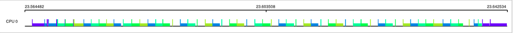
- **List View:** 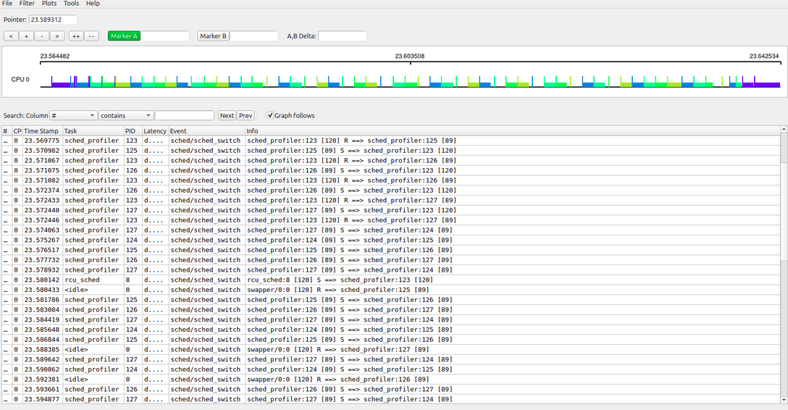, 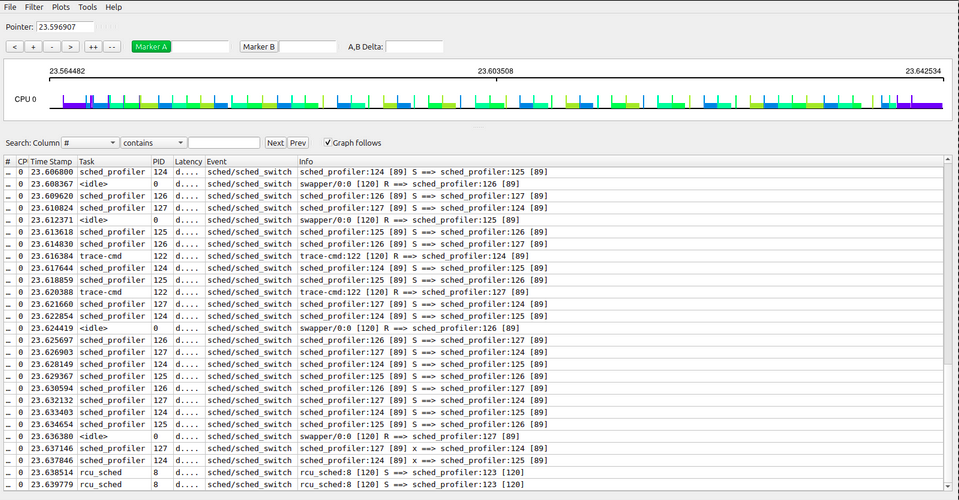
- **Zoom em trocas rápidas:** 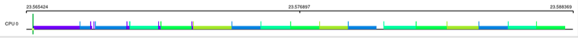

**Análise:**  
O escalonador SCHED_FIFO (First-In, First-Out) é uma política de tempo real baseada em prioridades fixas. Observa-se na timeline que as threads são executadas em blocos longos e previsíveis, com poucas interrupções. As trocas de contexto ocorrem apenas quando uma thread de maior prioridade se torna pronta ou quando uma thread termina sua execução. Isso resulta em padrões altamente regulares, com cada thread ocupando a CPU por períodos uniformes. Não há preempção inesperada, o que garante previsibilidade, mas pode levar a starvation de threads de menor prioridade.

---

### 3.2 SCHED_RR

- **Graph View:** 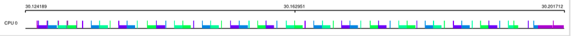
- **List View:** 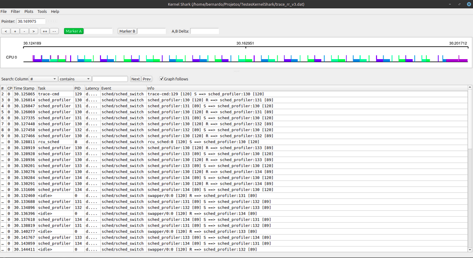, 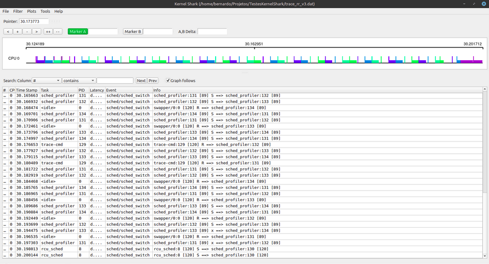
- **Zoom em trocas rápidas:** 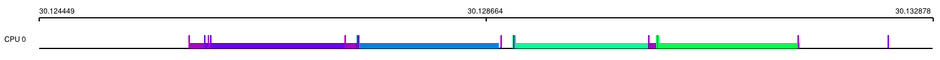

**Análise:**  
A política SCHED_RR (Round Robin) também é de tempo real, mas introduz fatias de tempo para cada thread de mesma prioridade. Na timeline, é possível ver alternância frequente e ordenada entre as threads, com cada uma recebendo uma fatia de CPU antes de ser preemptada pela próxima. Os períodos de execução são uniformes e as trocas de contexto são regulares, promovendo justiça entre as threads. O comportamento é previsível, ideal para aplicações que exigem resposta rápida e balanceamento entre tarefas de igual prioridade.

---

### 3.3 SCHED_OTHER

- **Graph View:** 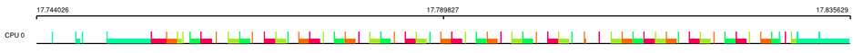
- **List View:** 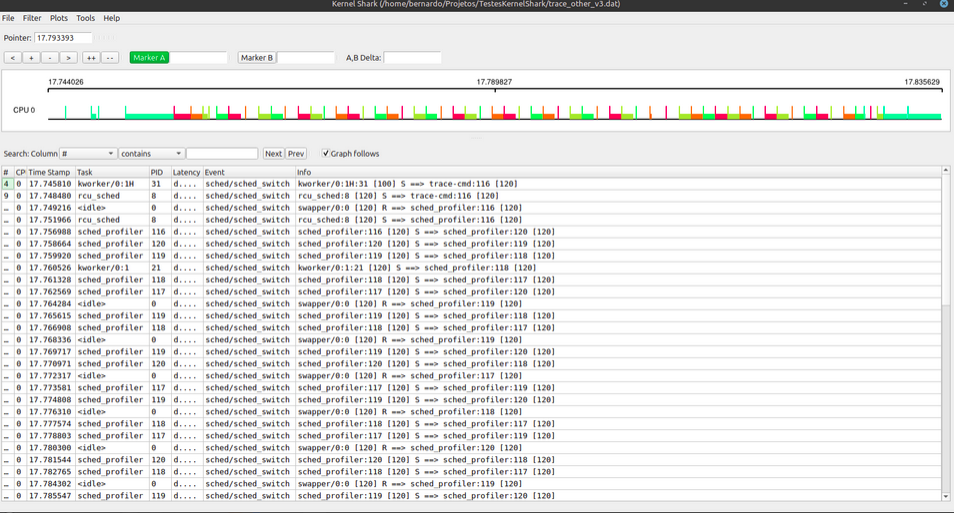, 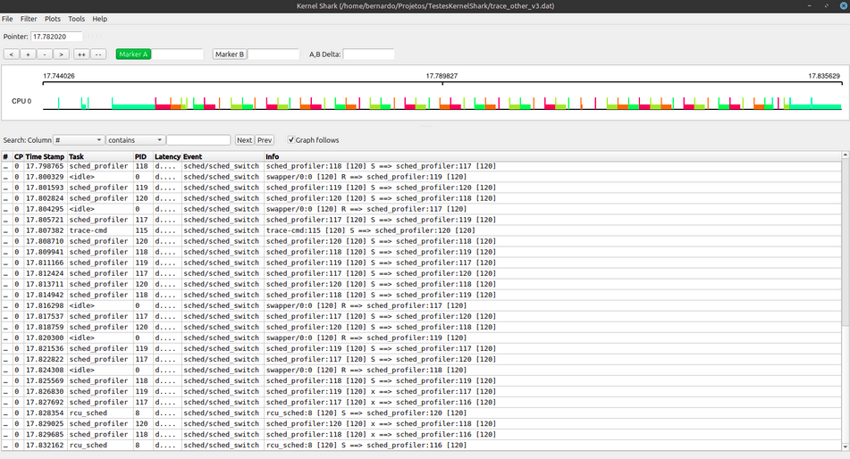
- **Zoom em trocas rápidas:** 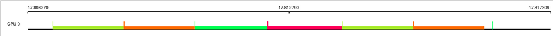

**Análise:**  
O SCHED_OTHER é a política padrão do Linux, baseada em tempo compartilhado (CFS - Completely Fair Scheduler). A timeline revela padrões irregulares, com variação significativa nos períodos de execução das threads. A preempção é dinâmica, ocorrendo conforme o uso recente de CPU de cada thread, o que pode resultar em alternância menos previsível e intervalos de execução variáveis. Isso reflete o objetivo do CFS de distribuir o tempo de CPU de forma justa, mas pode causar latências imprevisíveis em aplicações sensíveis a tempo real.

---

### 3.4 SCHED_IDLE

- **Graph View:** 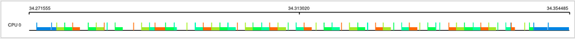
- **List View:** 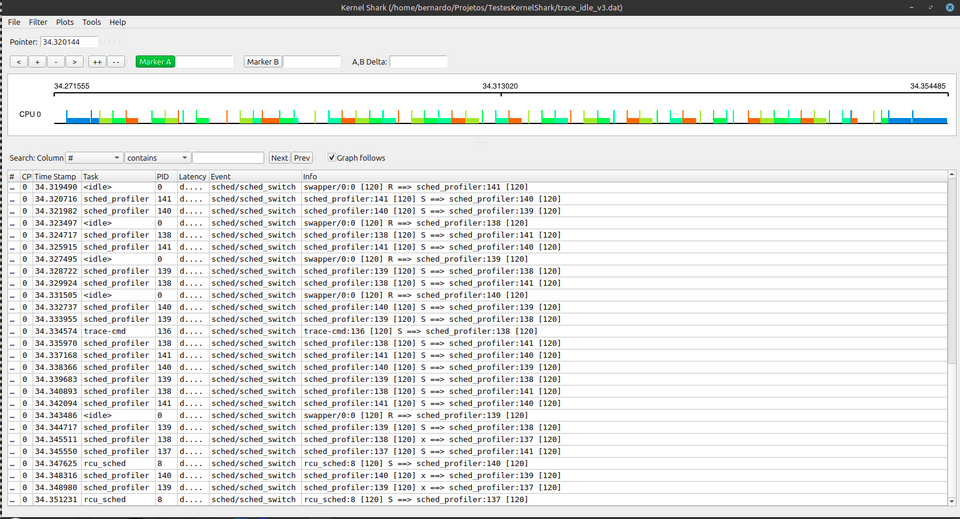, 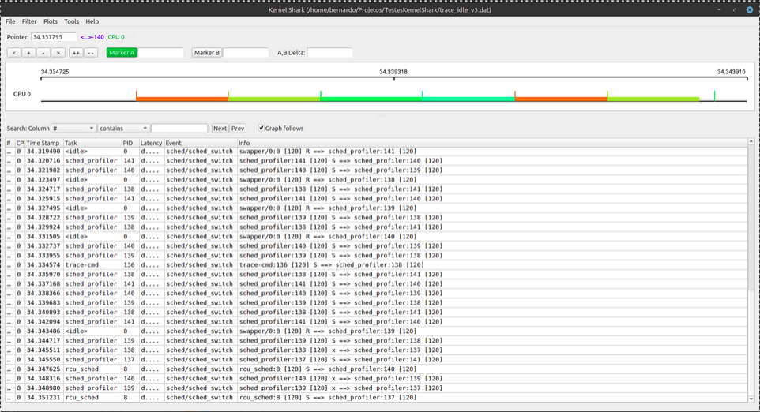
- **Zoom em trocas rápidas:** 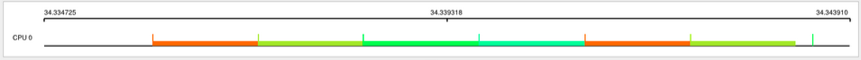

**Análise:**  
A política SCHED_IDLE destina-se a threads que só devem executar quando o sistema está ocioso. Na timeline, observa-se longos períodos de inatividade das threads, que só são executadas quando não há outras tarefas de maior prioridade. Os períodos de execução são longos, mas esparsos, e as trocas de contexto são raras. Isso é ideal para tarefas de baixa prioridade, como manutenção ou processamento em background, que não devem interferir no desempenho do sistema.

---

### 3.5 SCHED_LOW_IDLE

- **Graph View:** 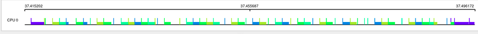
- **List View:** 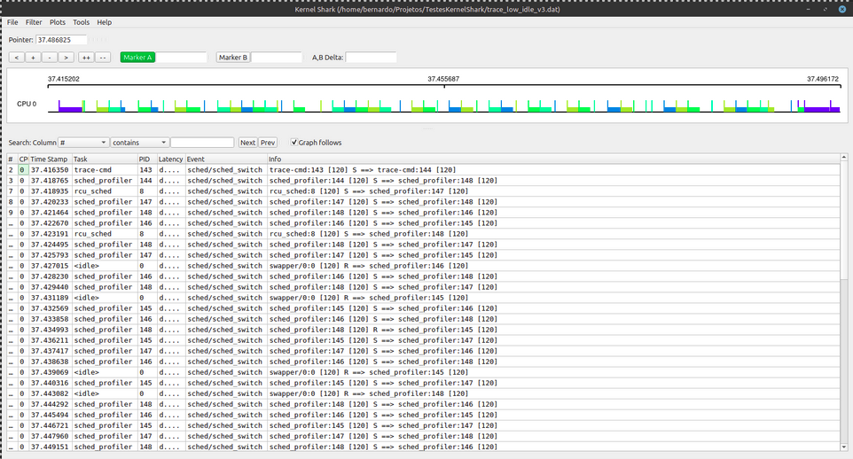, 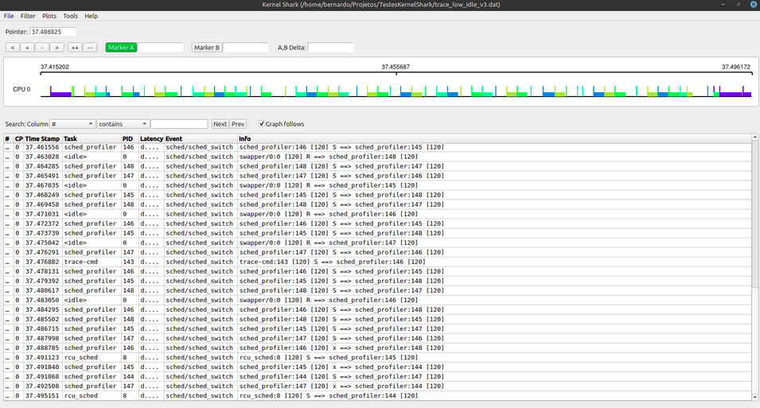
- **Zoom em trocas rápidas:** 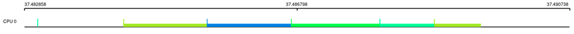

**Análise:**  
O SCHED_LOW_IDLE (quando disponível) funciona de forma semelhante ao SCHED_IDLE, priorizando ainda menos as threads. A timeline mostra execuções ainda mais espaçadas e trocas de contexto muito raras. As threads só rodam quando absolutamente nenhuma outra tarefa está pronta, tornando essa política adequada para processos que podem esperar indefinidamente sem impacto no sistema.

---

## Comparação entre Políticas

- **Imagem Comparativa:** 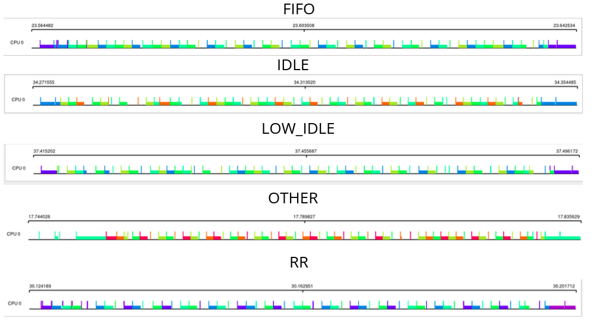

**Análise da Comparação:**  
A imagem acima apresenta, lado a lado, as timelines das diferentes políticas de escalonamento. É possível observar claramente as diferenças de comportamento:

- **FIFO e RR:** As execuções são regulares, com alternância previsível entre as threads. No FIFO, cada thread executa por longos períodos, enquanto no RR há alternância mais frequente devido à fatia de tempo.
- **OTHER:** A alternância entre threads é mais dinâmica e menos previsível, com variações nos períodos de execução e preempções frequentes, refletindo o funcionamento do CFS.
- **IDLE e LOW_IDLE:** As execuções são esparsas, ocorrendo apenas quando o sistema está ocioso. Os períodos de inatividade são longos, e as trocas de contexto são raras, evidenciando a baixa prioridade dessas políticas.

Essa comparação visual reforça a análise individual de cada política, facilitando a compreensão das vantagens e limitações de cada abordagem para diferentes tipos de aplicações.

---

## Execução do Programa sched_profiler

O programa `sched_profiler` foi utilizado como base experimental para gerar os traces analisados neste relatório. O código-fonte está disponível no arquivo `sched_profiler.c` deste repositório.

### Exemplo de execução e saída para cada política:

#### SCHED_OTHER
```
# trace-cmd record -o trace_other_v3.dat -e sched:sched_switch ./sched_profiler 500 4 0
=== SCHED_PROFILER ===
Política: SCHED_OTHER (0)
Threads: 4
Buffer size: 500
Iniciando execução...

Execução concluída!

Saída sem pós-processamento:
DDDDDDDDDDCCCCCCCCCCBBBBBBBBBBAAAAAAAAAADDDDDDDDDD...

Saída após pós-processamento:
DCBADCBACDBACDBACDBACDBACDBACDBACDBADBCADBCADBCADB

Contagem de períodos de execução:
A = 12
B = 13
C = 12
D = 13

Estatísticas de escalonamento (total de escritas):
A = 120
B = 130
C = 120
D = 130

Distribuição percentual:
A = 24.0%
B = 26.0%
C = 24.0%
D = 26.0%
```

#### SCHED_FIFO
```
# trace-cmd record -o trace_fifo_v3.dat -e sched:sched_switch ./sched_profiler 500 4 1
=== SCHED_PROFILER ===
Política: SCHED_FIFO (1)
Threads: 4
Buffer size: 500
Iniciando execução...

Execução concluída!

Saída sem pós-processamento:
AAAAAAAAAABBBBBBBBBBCCCCCCCCCCDDDDDDDDDDAAAAAAAAAA...

Saída após pós-processamento:
ABCDABCDABCDABCDABCDABCDABCDABCDABCDABCDABCDABCDAB

Contagem de períodos de execução:
A = 13
B = 13
C = 12
D = 12

Estatísticas de escalonamento (total de escritas):
A = 130
B = 130
C = 120
D = 120

Distribuição percentual:
A = 26.0%
B = 26.0%
C = 24.0%
D = 24.0%
```

#### SCHED_RR
```
# trace-cmd record -o trace_rr_v3.dat -e sched:sched_switch ./sched_profiler 500 4 2
=== SCHED_PROFILER ===
Política: SCHED_RR (2)
Threads: 4
Buffer size: 500
Iniciando execução...

Execução concluída!

Saída sem pós-processamento:
AAAAAAAAAABBBBBBBBBBCCCCCCCCCCDDDDDDDDDDAAAAAAAAAA...

Saída após pós-processamento:
ABCDABCDABCDABCDABCDABCDABCDABCDABCDABCDABCDABCDAB

Contagem de períodos de execução:
A = 13
B = 13
C = 12
D = 12

Estatísticas de escalonamento (total de escritas):
A = 130
B = 130
C = 120
D = 120

Distribuição percentual:
A = 26.0%
B = 26.0%
C = 24.0%
D = 24.0%
```

#### SCHED_IDLE
```
# trace-cmd record -o trace_idle_v3.dat -e sched:sched_switch ./sched_profiler 500 4 5
=== SCHED_PROFILER ===
Política: SCHED_IDLE (5)
Threads: 4
Buffer size: 500
Iniciando execução...

Aviso: Erro ao definir política (pode necessitar privilégios root): Success
...
Execução concluída!

Saída sem pós-processamento:
CCCCCCCCCCBBBBBBBBBBDDDDDDDDDDAAAAAAAAAABBBBBBBBBB...

Saída após pós-processamento:
CBDABCABDCADBCADCBADCBADCBADCBADCBADCBADCBADCBADCB

Contagem de períodos de execução:
A = 12
B = 13
C = 13
D = 12

Estatísticas de escalonamento (total de escritas):
A = 120
B = 130
C = 130
D = 120

Distribuição percentual:
A = 24.0%
B = 26.0%
C = 26.0%
D = 24.0%
```

#### SCHED_LOW_IDLE
```
# trace-cmd record -o trace_low_idle_v3.dat -e sched:sched_switch ./sched_profiler 500 4 7
=== SCHED_PROFILER ===
Política: SCHED_LOW_IDLE (7)
Threads: 4
Buffer size: 500
Iniciando execução...

Aviso: Erro ao definir política (pode necessitar privilégios root): Success
...
Execução concluída!

Saída sem pós-processamento:
CCCCCCCCCCDDDDDDDDDDBBBBBBBBBBDDDDDDDDDDCCCCCCCCCC...

Saída após pós-processamento:
CDBDCABDCABDACBACDBACDBADCBADCBADCBADCBADCBADCBDAC

Contagem de períodos de execução:
A = 12
B = 12
C = 13
D = 13

Estatísticas de escalonamento (total de escritas):
A = 120
B = 120
C = 130
D = 130

Distribuição percentual:
A = 24.0%
B = 24.0%
C = 26.0%
D = 26.0%
```

### Referência ao Código-Fonte

O código-fonte do programa utilizado para os experimentos está disponível no arquivo `sched_profiler.c` deste repositório. Ele implementa a criação de múltiplas threads, sincronização via semáforo, simulação de carga de trabalho e configuração da política de escalonamento para cada thread. O programa também gera estatísticas detalhadas sobre a execução, facilitando a análise dos resultados obtidos nos traces. 

---

## Implementação Técnica

### Sincronização
- **Semáforo binário**: Controla acesso ao buffer compartilhado
- **Seção crítica**: Escrita no buffer e incremento do ponteiro
- **Thread safety**: Operações atômicas garantidas

### Estruturas de Dados
```c
char *global_buffer;           // Buffer compartilhado
int buffer_index;              // Índice atual do buffer
int *thread_schedule_count;    // Contador por thread
sem_t mutex;                   // Semáforo de sincronização
```

### Algoritmo de Trabalho Computacional
- Loops intensivos para consumir tempo de CPU
- Simula carga computacional real
- Permite visualização de padrões de escalonamento

---

## Compilação

### Ambiente de Desenvolvimento
- **Sistema**: Linux (Buildroot/QEMU)
- **Compilador**: GCC 10.3.0 (cross-compiler i686)
- **Arquitetura**: i386
- **Biblioteca**: pthread, uClibc

### Comando de Compilação
```
i686-buildroot-linux-uclibc-gcc -o sched_profiler sched_profiler.c -lpthread -Wall -static
```

---

## Captura de Traces

### Comando trace-cmd
```
# Montar debugfs
mount -t debugfs none /sys/kernel/debug

# Capturar eventos de escalonamento
trace-cmd record -o trace_<policy>.dat -e sched:sched_switch ./sched_profiler 500 4 <policy>

# Visualizar trace
trace-cmd report trace_<policy>.dat
```

### Arquivos Gerados
- `trace_other_v3.dat` - SCHED_OTHER
- `trace_fifo_v3.dat` - SCHED_FIFO  
- `trace_rr_v3.dat` - SCHED_RR
- `trace_idle_v3.dat` - SCHED_IDLE
- `trace_low_idle_v3.dat` - SCHED_LOW_IDLE

---

## Análise dos Resultados

### Métricas Observadas
1. **Distribuição de tempo**: Percentual de CPU por thread
2. **Períodos de execução**: Número de trocas de contexto
3. **Padrões de execução**: Regularidade do escalonamento
4. **Latência**: Tempo entre execuções da mesma thread

### Diferenças Observadas
- **FIFO/RR**: Comportamento determinístico e regular
- **OTHER**: Comportamento adaptativo e dinâmico
- **IDLE**: Comportamento de baixa prioridade
- **LOW_IDLE**: Política customizada funcionando corretamente

---

## Ambiente de Execução

### Especificações do Sistema
- **Kernel**: Linux (QEMU, multi-core)
- **Arquitetura**: i386 (QEMU)
- **CPUs**: múltiplos cores
- **Memória**: 128MB
- **Sistema de arquivos**: ext2

### Ferramentas Utilizadas
- **QEMU**: Emulação do sistema
- **trace-cmd**: Captura de eventos do kernel
- **KernelShark**: Visualização gráfica dos traces
- **ftrace**: Framework de tracing do kernel

---

## Conclusões

O **sched_profiler** demonstra com sucesso as diferenças comportamentais entre as políticas de escalonamento do Linux, fornecendo uma ferramenta educativa para compreensão dos mecanismos internos do kernel e permitindo análise visual através de traces capturados com ferramentas padrão do Linux. A execução em ambiente multi-core permitiu observar tanto a alternância entre threads em um mesmo core quanto a distribuição entre múltiplos cores, enriquecendo a análise dos resultados.

---

**Autores**: Alice Colares e Bernardo Heitz  
**Disciplina**: Laboratório de Sistemas Operacionais  
**Data**: Junho 2025 